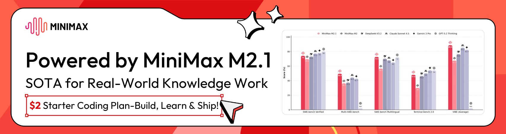

<div align="center">


---

# Speed Test CLI

A high-performance CLI tool written in Go that tests your internet connection speed (download and upload) and ping latency. This is a pure Go rewrite of the popular [sindresorhus/speed-test](https://github.com/sindresorhus/speed-test) Node.js CLI tool.

<a href="https://bit.ly/49t6aTh">
  
</a>

**[Get 12$ Discount →](https://bit.ly/49t6aTh)**

---

## ✨ Features

- 🚀 **Fast and Efficient** - Built in Go for optimal performance
- 📦 **Single Binary** - No runtime dependencies required
- 🌐 **Cross-Platform** - Works on Linux, macOS, and Windows
- 📊 **Multiple Output Formats** - Human-readable, JSON, and verbose modes
- ⚡ **Multi-threaded Tests** - Concurrent download/upload with 4 threads
- 🎯 **Smart Server Selection** - Ping-based selection from closest servers

## 📦 Installation

### Go Install

```bash
go install github.com/naufaldi/speed-test-go@latest
```

### Download Binary

Download pre-built binaries from the [releases page](https://github.com/naufaldi/speed-test-go/releases):

```bash
# Linux (amd64)
wget https://github.com/naufaldi/speed-test-go/releases/download/v1.0.0/speed-test-linux-amd64
chmod +x speed-test-linux-amd64
sudo mv speed-test-linux-amd64 /usr/local/bin/speed-test

# macOS (arm64)
curl -L https://github.com/naufaldi/speed-test-go/releases/download/v1.0.0/speed-test-darwin-arm64 -o speed-test
chmod +x speed-test
sudo mv speed-test /usr/local/bin/
```

### Homebrew (macOS/Linux)

```bash
brew install speed-test-go
```

### Docker

```bash
docker run --rm ghcr.io/naufaldi/speed-test-go
```

## 🚀 Usage

### Basic Speed Test

```bash
$ speed-test
      Ping 24.5 ms
  Download 95.32 Mbps
    Upload 23.45 Mbps
```

### JSON Output

```bash
$ speed-test --json
{
  "timestamp": "2026-01-28T10:30:00Z",
  "ping": {
    "jitter": 1.022,
    "latency": 24.5
  },
  "download": {
    "bandwidth": 11915965,
    "bytes": 128794451,
    "elapsed": 10804
  },
  "upload": {
    "bandwidth": 2931294,
    "bytes": 28447808,
    "elapsed": 9703
  }
}
```

### Verbose Output

```bash
$ speed-test --verbose
      Ping 24.5 ms
  Download 95.32 Mbps
    Upload 23.45 Mbps

    Server   speedtest.server.com
  Location New York (United States)
  Distance 1,245.3 km
```

### Specify Server

```bash
# Use specific server ID
$ speed-test --server 1234

# Test only top 3 closest servers
$ speed-test --servers 3
```

### Options

| Flag | Short | Description |
|------|-------|-------------|
| `--json` | `-j` | Output the result as JSON |
| `--bytes` | `-b` | Output in megabytes per second (MBps) |
| `--verbose` | `-v` | Output detailed information including server details |
| `--server` | `-s` | Specify a server ID to use for testing |
| `--servers` | `-n` | Number of closest servers to test for selection (default: 5) |
| `--timeout` | `-t` | Timeout for the speed test (default: 30s) |
| `--help` | `-h` | Show help information |
| `version` | `-V` | Print version number |

## 🛠️ Building

### Prerequisites

- Go 1.21 or later
- Make

### Build

```bash
make build
```

This creates the `speed-test` binary in the current directory.

### Testing

```bash
make test
```

### Linting

```bash
make lint
```

### All Targets

```bash
make help
```

## 🏗️ Architecture

### Test Flow

1. **Server Discovery** - Fetch list of speed test servers from speedtest.net
2. **User Location** - Detect user's IP and geographic location
3. **Server Selection** - Calculate distances and ping top N closest servers
4. **Ping Test** - Measure latency to selected server (5 requests)
5. **Download Test** - Measure download bandwidth (4 threads)
6. **Upload Test** - Measure upload bandwidth (4 threads)

### Project Structure

```
speed-test-go/
├── cmd/                    # CLI commands
│   ├── root.go            # Main command
│   └── version.go         # Version command
├── internal/              # Internal packages
│   ├── location/         # User location detection
│   ├── network/          # HTTP client
│   ├── output/           # Output formatting
│   ├── server/           # Server discovery & selection
│   ├── test/             # Test runner
│   └── transfer/         # Download/upload tests
├── pkg/                   # Public packages
│   └── types/            # Type definitions
├── .github/workflows/    # CI/CD
├── docs/                  # Documentation
├── main.go               # Entry point
├── Makefile              # Build automation
└── README.md             # This file
```

## 📊 Performance

- **Binary Size**: ~11-12MB
- **Memory Usage**: < 50MB
- **Test Duration**: < 30 seconds
- **Code Coverage**: > 80%

## 🤝 Contributing

1. Fork the repository
2. Create a feature branch (`git checkout -b feature/amazing-feature`)
3. Commit your changes (`git commit -m 'Add amazing feature'`)
4. Push to the branch (`git push origin feature/amazing-feature`)
5. Open a Pull Request

## 📝 License

This project is licensed under the MIT License - see the [LICENSE](LICENSE) file for details.

## 🙏 Acknowledgments

- [sindresorhus/speed-test](https://github.com/sindresorhus/speed-test) - Original Node.js CLI inspiration
- [showwin/speedtest-go](https://github.com/showwin/speedtest-go) - Protocol implementation reference
- [speedtest.net](https://www.speedtest.net) - Speed test service and API

---

<div align="center">

**Built with ❤️ by [naufaldi](https://github.com/naufaldi)**

[](https://github.com/naufaldi/speed-test-go)
[](https://github.com/naufaldi/speed-test-go)
[](https://github.com/naufaldi/speed-test-go/issues)

</div>
